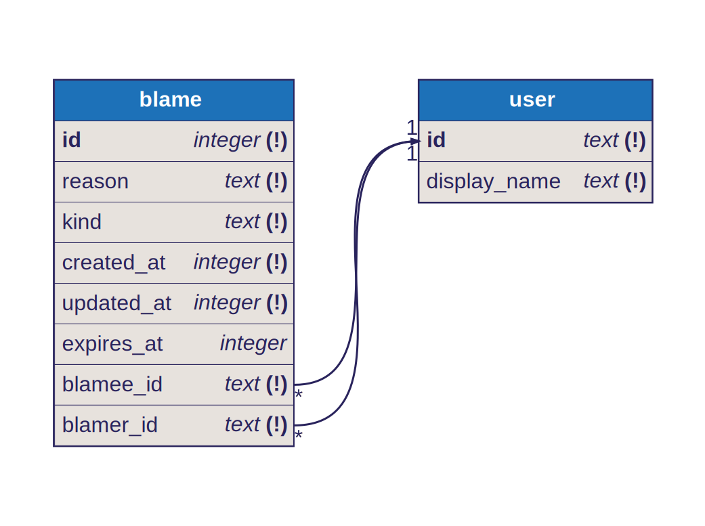

Our database is a simple SQLite DB managed with `drizzle-orm`.
The schema below is automatically generated by the `dbml.ts` script.

## Schema

## Contributing

When modifying the Database, please remember to run the `dbml.ts` script and commit the new schema.
To generate the new migrations run `bun run drizzle-kit generate` and check what `drizzle` generated, sometimes you'll need to edit it or do it manually (like `CHECK` constraints which aren't supported by `drizzle` yet).
